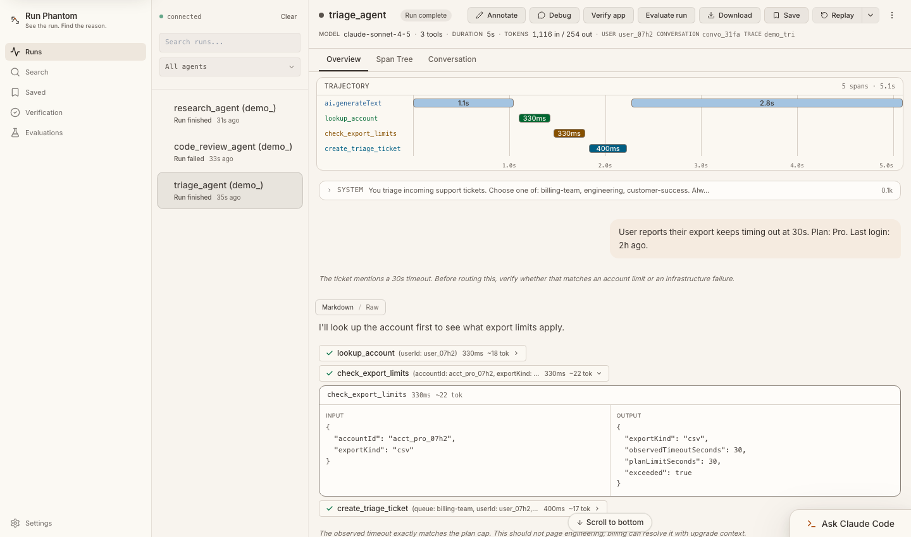

<p align="center">
  
</p>

<h1 align="center">Run Phantom</h1>

<p align="center"><strong>See the run. Find the reason.</strong></p>

<p align="center">
  Local debugging · Regression evaluations · Shared projects
</p>

<p align="center">
  <a href="#quick-start">Quick start</a> ·
  <a href="#connect-your-agent">Connect your agent</a> ·
  <a href="#shared-projects">Team setup</a> ·
  <a href="#documentation">Documentation</a> ·
  <a href="./LICENSE">MIT license</a>
</p>

Run Phantom is an open-source debugger for AI-agent runs. Inspect the prompts,
tool calls, outputs, and timing behind a result. Replay through your own code,
check a change against frozen evidence, and give your team a shared place to
investigate failures.

The local debugger stores traces in SQLite on your machine. Capture, inspection,
search, and deterministic evaluations work without a provider API key or a
hosted Run Phantom account.



<p align="center"><sub>Actual application UI with synthetic example traces.</sub></p>

## From a failed run to a checked change

| Your goal | What Run Phantom gives you |
| --- | --- |
| **Understand the failure** | A local timeline, span tree, captured inputs and outputs, tool arguments, errors, and searchable trace history. |
| **Check the fix** | Structured run comparison, versioned regression datasets, frozen experiment results, and JSON/JUnit reports for CI. |
| **Investigate together** | A separate authenticated service with project roles, shared traces, authored notes, saved checks, and audit history. |

## Quick start

**Requires Git and Bun 1.4.0 or newer.** Clone the repository and start the app:

```bash
git clone https://github.com/RunPhantom/Run-Phantom.git
cd Run-Phantom
bun install --frozen-lockfile
bun run dev
```

Open **[http://localhost:5948](http://localhost:5948)** and choose **Load demo
traces** on the empty Runs screen. The demo uses synthetic data and makes no
provider calls. Open a run, explore its **Overview** and **Span Tree**, and select
a span to inspect its evidence.

To add three more examples from a second terminal:

```bash
bun run seed:traces
```

These cover a successful edit, a tool failure followed by recovery, and a nested
subagent review. Continue using the UI on port `5948`.

| Local service | Default address |
| --- | --- |
| Development UI | `http://localhost:5948` |
| Daemon API and WebSocket | `http://127.0.0.1:5947` |
| OTLP/HTTP trace endpoint | `http://127.0.0.1:5947/v1/traces` |

<details>
<summary><strong>Run the built UI or install a local binary</strong></summary>

To serve the built UI from the daemon without the Vite development server, stop
`bun run dev`, then run:

```bash
bun run build
bun x runphantom-dev
```

The CLI starts the daemon and opens the built UI on port `5947`. The
`runphantom-dev` wrapper is linked during dependency installation.

To build, install, and smoke-test a standalone binary in a persistent location
on macOS or Linux:

```bash
bun run install:local --install-dir="$HOME/.local/bin"
export PATH="$HOME/.local/bin:$PATH"
runphantom --help
```

Add the `PATH` export to your shell configuration to retain it in future shells.
Without `--install-dir`, the installer uses `/tmp/runphantom-local/bin`.

</details>

## Connect your agent

Point your instrumented application's **OTLP/HTTP trace exporter** at the local
daemon:

```bash
export OTEL_EXPORTER_OTLP_TRACES_ENDPOINT=http://127.0.0.1:5947/v1/traces
```

Run Phantom recognizes OpenTelemetry GenAI and OpenInference conventions
alongside its existing SDK adapters. What appears in a trace depends on what
your instrumentation captures; configure message content capture when you need
prompts and responses, and flush the exporter before a short-lived process exits.

The [example applications](./examples/README.md) show complete integrations in
TypeScript/Bun, Python, Go, and Rust. They export OTLP/HTTP JSON without a Run
Phantom SDK. Provider-backed examples require their own API keys.

To write the exporter target into your agent project's `.env` from this checkout:

```bash
bun x runphantom-dev connect --file=/path/to/agent-project/.env
```

This configures the destination and opens the built UI. Your application still
needs instrumentation. Use `bun x runphantom-dev connect --print` to print the
target without changing files.

## Debug with the full context

- **Follow the run.** Move between the overview, span tree, captured messages,
  and tool details. Inspect available model, usage, status, and timing evidence.
- **Find the relevant failure.** Search captured inputs, outputs, span names,
  and run metadata. Narrow results by status, model, or provider.
- **Keep the evidence.** Annotate and save runs, download a versioned JSON trace,
  or use **Import trace** in Local Search to open an exported capture.
- **Compare a change.** Inspect input/output, tool, model, usage, and timing
  differences. Ambiguous repeated calls and missing evidence remain explicit.
- **Work from your agent tools.** Use MCP trace tools or open a trace-aware
  Claude Code or Codex session when the corresponding local CLI is installed
  and authenticated.

Replay sends a new execution request to a registered, project-owned endpoint.
Follow the [replay setup guide](./skills/setup-agent-replay/SKILL.md) to add the
endpoint and `.runphantom/agents.yaml` to your agent project, then register it
from this checkout:

```bash
bun x runphantom-dev replay register --cwd=/path/to/agent-project
```

Your endpoint controls tool side effects, provider calls, and runtime state.
Replay does not restore arbitrary process checkpoints.

For a connected web application, the **Verification** workspace can also check
explicit browser outcomes and retain the resulting evidence. See the
[application verification guide](./src/verification/README.md).

<details>
<summary><strong>Trace search and import behavior</strong></summary>

Search matches literal text, with bounded execution and paged results. Narrow a
query if it exceeds the time limit. Pagination follows the live store rather
than a frozen snapshot.

Trace downloads include captured payloads and annotations; review those contents
before sharing. Importing a trace with an existing ID replaces its captured
spans. Identical annotations can be reimported, while conflicting annotation
identities or changes that would orphan notes reject the whole import.

Exports recovered only from a saved cache are marked as legacy captures and may
contain compacted payloads.

</details>

## Evaluations and CI

Turn a captured failure into a regression case:

1. Open a run and choose **Evaluate run**.
2. Create a dataset case with an expected response, JSON value, tool call,
   argument, error condition, or resource budget.
3. Select captured candidate runs and start an experiment.
4. Inspect **pass**, **fail**, or **inconclusive** results, then compare compatible
   baseline and candidate experiments.

Experiments freeze the dataset revision, candidate evidence, and evaluator
versions. They score captured runs; starting an experiment does not rerun your
agent. Missing or mismatched input remains inconclusive. Optional model grading
requires credentials and explicit opt-in to send selected data to a provider.

Export a **JSON report** or **JUnit report** from the UI, or check saved results
from a script:

```bash
bun scripts/check-evaluation.ts --experiment EXPERIMENT_ID

bun scripts/check-evaluation.ts \
  --experiment CANDIDATE_ID \
  --baseline BASELINE_ID \
  --format junit \
  --output results.junit.xml
```

| Exit code | Meaning |
| --- | --- |
| `0` | Every case passed and the experiment is complete. |
| `1` | Failed, inconclusive, or unfinished evidence. |
| `2` | Invalid arguments, incompatible comparison, or an operational error. |

Baseline comparisons require the same dataset revision and compatible evaluator
versions. `--output` creates a new file and never overwrites an existing one.
Use `--url` or `RUNPHANTOM_URL` to select a daemon.

Reports omit raw captured inputs/outputs, expected/actual payload values, and
free-form model explanations. Inconclusive JUnit results are errors rather than
successful skips. Report generation makes no provider calls.

**Repeated trials:** select 2–20 compatible terminal experiments to inspect
pass/fail/unknown counts, resolved coverage, and missing-evidence bounds. Every
selected trial contributes to the result. These bounds describe unresolved
evidence; they are not statistical confidence intervals.

Read the [evaluation guide](./src/evaluations/README.md) for rule semantics,
versioning, model grading, and repeated-trial requirements.

## Shared projects

Team mode gives colleagues a shared workspace for captured traces, notes, and
deterministic checks. It runs as a **separate service with its own database**.

```bash
bun run build
bun src/index.ts team serve
```

Open **[http://127.0.0.1:5949/team](http://127.0.0.1:5949/team)**. On first launch,
read the setup code from `~/.runphantom/team/bootstrap.code`, create the owner
account, and create a project.

| Role | Project access |
| --- | --- |
| **Viewer** | Inspect traces, notes, metrics, and saved checks. |
| **Editor** | Viewer access, plus authored notes and deterministic checks. |
| **Admin** | Editor access, plus members, invitations, ingestion keys, and audit history. |

Project ingestion keys grant write-only trace ingestion. Saved checks retain
frozen evidence and results even when the original live trace changes or is
deleted. Local replay and machine commands stay in the local debugger process.

For network sharing, configure a dedicated HTTPS origin and explicitly trusted
reverse-proxy peers. The [team service guide](./src/team/README.md) covers the
exporter endpoint, setup codes, roles, deployment, backups, and storage limits.

## Configuration and CLI

| Setting | Purpose | Default |
| --- | --- | --- |
| `RUNPHANTOM_PORT` | Local daemon port; setting it requires that exact port | `5947` when available |
| `RUNPHANTOM_BIND_HOST` | Local daemon bind address | `127.0.0.1` |
| `RUNPHANTOM_UI_PORT` | Development UI port | `5948` |
| `RUNPHANTOM_DB_PATH` | Local SQLite file | `~/.runphantom/runphantom.db` |
| `RUNPHANTOM_URL` | Daemon URL for MCP and supporting scripts | `http://127.0.0.1:5947` |

Use exported shell variables for daemon overrides. The
[environment reference](./.env.example) explains local settings, provider keys,
and the permission controls for optional local agent sessions. Team configuration
is documented separately in the [team guide](./src/team/README.md).

```bash
bun x runphantom-dev --help   # All commands and daemon settings
bun x runphantom-dev serve    # Foreground daemon
bun x runphantom-dev status   # Daemon health
bun x runphantom-dev setup    # Configure supported agent integrations
bun x runphantom-dev mcp      # MCP server over stdio
```

Build the UI first when using daemon commands from a fresh checkout. Optional
AI features use your configured provider credentials or authenticated local
agent CLI; core trace inspection and deterministic checks need neither.

## Development

The daemon, React UI, SQLite schema, CLI, MCP tools, examples, and tests are all
in this repository.

```bash
bun run build
bun run test
bun run lint
bun x tsc --noEmit
(cd app && bun x tsc --noEmit)
```

For provider integrations, follow the [example setup guides](./examples/README.md).
`bun run dev:examples` starts its own daemon and example suite; stop the regular
development server first. Individual examples may need additional runtimes.

See the [agent and contributor guide](./AGENTS.md) for repository conventions
and verification requirements.

## Documentation

| Guide | What you will find |
| --- | --- |
| [Example applications](./examples/README.md) | Instrumentation and runnable integrations across languages. |
| [Replay setup](./skills/setup-agent-replay/SKILL.md) | Project-owned replay endpoints and configuration. |
| [Application verification](./src/verification/README.md) | Connected browser sessions, outcomes, and saved flows. |
| [Regression evaluations](./src/evaluations/README.md) | Datasets, frozen evidence, grading, reports, and repeated trials. |
| [Shared team service](./src/team/README.md) | Accounts, project roles, ingestion, deployment, and operational limits. |
| [Environment reference](./.env.example) | Local configuration and optional provider features. |
| [Research and source audit](./RESEARCH.md) | Inspected architecture references and the limits of the comparison evidence. |

## License

Run Phantom is owned and maintained by **Divyam Talwar** and released under the
[MIT license](./LICENSE). Retain its copyright and permission notice in copies
and substantial portions of the software. See
[third-party notices](./THIRD_PARTY_NOTICES.md) for dependency and trademark notes.
